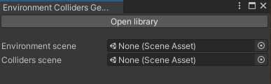
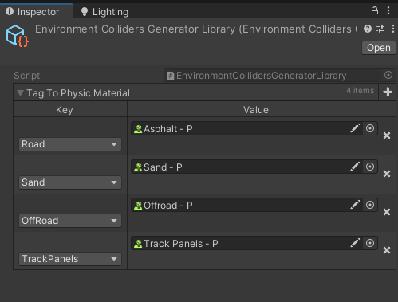
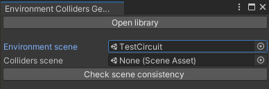
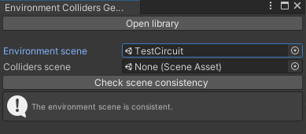
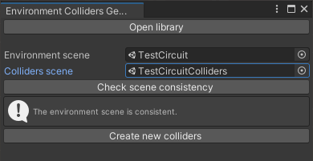
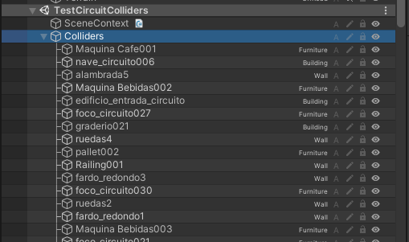

# EnvironmentCollidersGenerator

Tool to autogenerate a colliders scene from a meshes scene.

Generated colliders will be mesh colliders pointing to the original mesh and will have the same layer, tags and names.
They won't have the same hierarchy so that we gain some performance with a simpler hierarchy.

You can also automatically apply physic materials to specific tags.

Meshes, skinned meshes and terrain colliders are currently supported.

## Usage

Open the tool with `WhateverDevs/Scene Management/Environment Colliders Generator`.

You can click on open library to set up some variables.

We currently allow you to define specific physic materials to be applied to colliders with specific tags.

Once you are set, select the scene where you have your meshes.

A new button will show up to check the consistency of the scene. This will do a scan to make sure that there are no
renderers that point to null meshes or other shenanigans.

Once the scan is done, you should be seeing a message telling the scene is consistent. If not, check the console.

Now reference the scene where you want to put the colliders. A new button will show up to generate them.

Once the colliders are generated, they will show up on the scene under an object named "Colliders".

